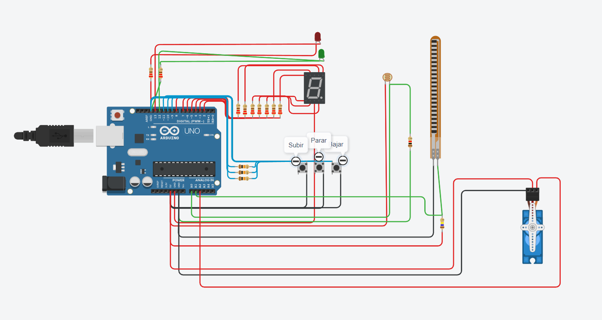
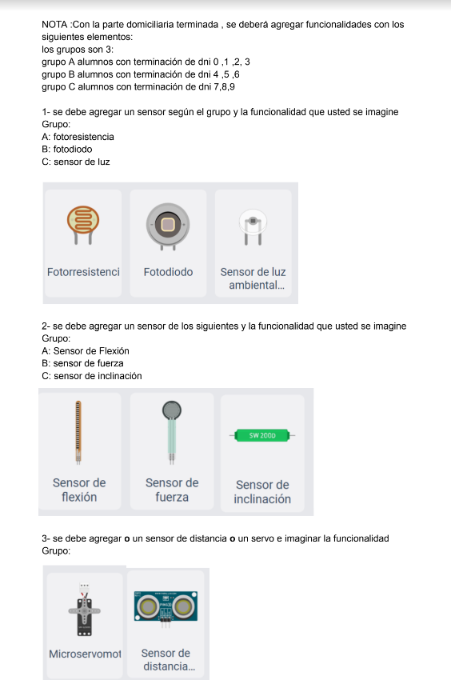
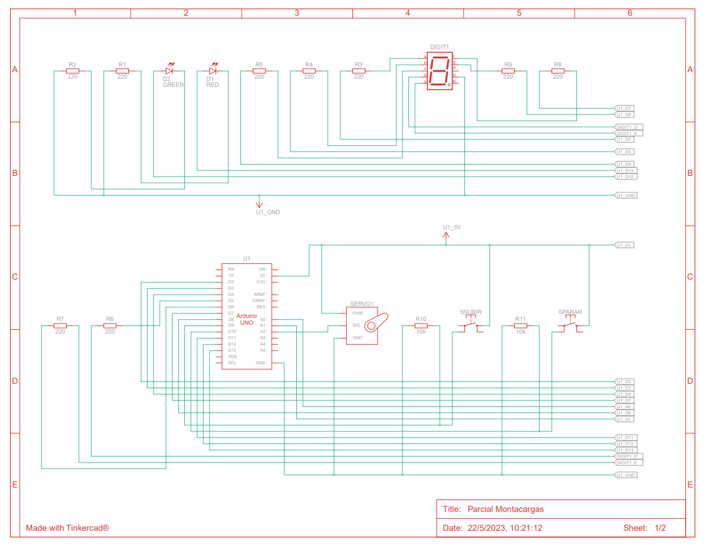

## Integrante
- Gonzalo Rojas

## Proyecto: Montacargas.

## Descripción:
Se nos pide armar un modelo de montacarga funcional como maqueta para un hospital. El objetivo es que implementes un sistema que pueda recibir ordenes de subir, bajar o pausar desde diferentes pisos y muestre el estado actual del montacargas en el display 7 segmentos.

## Funcion del Proyecto:
• El proyecto consta en un visualizador de 7 segmentos, led rojo/verde, y 3 botones cuyas funciones tienen: parar, subir, detener montacargas. En el cual tiene que ser visualizado en que piso se encuentra por medio del visualizador de 7 segmentos.

## Requisitos del Proyecto:
1_ Interfaz de usuario:  
• Deberá haber 3 botones, uno para subir pisos, otro para bajar pisos y otro para
detener el montacarga.  
• Deberá tener 2 LEDs, uno verde que indicará cuando el montacarga este en
movimiento, otro rojo que indique cuando el montacarga esté pausado.  
• En el display 7 segmentos deberán informar en tiempo real en qué piso se
encuentra el elevador.  
• Se sabe que el tiempo de trayecto entre pisos es de 3 segundos (3000 ms). •
Se deberá informar por monitor serial el piso en el que se encuentra el
montacarga, este en funcionamiento o en pausa.  
2_ Funcionamiento del montacarga:  
• Implementa un algoritmo que permita que el elevador suba y baje o frene
presionando los botones correspondientes.  
• Deberán buscar una forma para pausar el montacargas cuando el usuario lo
determine.  
3_ Documentación:  
• Deberán presentar un diagrama esquemático del circuito y explicar el
funcionamiento aplicado de cada componente.  
• Presentar el código fuente del proyecto de Arduino listo para ser
implementado.  
• Deberán explicar el funcionamiento integral utilizando documentación
MarkDown.

## Requerimientos extras:

~~~ C++ (lenguaje en el que esta escrito)
// Gonzalo Rojas Div D

#include <Servo.h>
Servo myServo;
// Defino segmentos de los numeros
int a = 2;
int b = 3;
int c = 4;
int d = 5;
int e = 6;
int f = 7;
int g = 8;

//Definicion de los pines
const int botonSubir = 9;
const int botonParar = 10;
const int botonBajar = 11;
int pinVerde = 12;
int pinRojo =  13;
int LDRPin = A0;
int flexionPin = A1;

//Variables
int piso_Actual = 0;
bool movimiento_Subir = false;
bool movimiento_Bajar = false;

void setup() {
  pinMode(a, OUTPUT);
  pinMode(b, OUTPUT);
  pinMode(c, OUTPUT);
  pinMode(d, OUTPUT);
  pinMode(e, OUTPUT);
  pinMode(f, OUTPUT);
  pinMode(g, OUTPUT);
  
  pinMode(botonSubir, INPUT);
  pinMode(botonParar, INPUT);
  pinMode(botonBajar, INPUT);
  
  pinMode(LDRPin, INPUT);
  pinMode(A1, INPUT);
  
  Serial.begin(9600);
  
  //Seteo mi servo
  myServo.attach(A2,500,2500);
}

void loop() {
  int LDRStatus = analogRead(LDRPin);
  if (LDRStatus <= 500)
  {
    mostrar_piso();
    int subiendo;
    subiendo = digitalRead(9);
    if (subiendo == 1 || movimiento_Subir == true)
    {
      subir();
    }
    
    int bajando;
    bajando = digitalRead(11);
    if (bajando == 1 || movimiento_Bajar == true)
    {
      bajar();
    }
    
    int parar;
    parar = digitalRead(10);
    if (parar == 1)
    {
      pararse();
    }
    
    float x = analogRead(A1);
    float y = (((x-159)/352)*100);
    if (y == 100)
    {
      forzar_reinicio();
    }
  }
  
  if (piso_Actual >= 0 && piso_Actual <= 9)
  {
    int grados = map(piso_Actual, 0, 9, 0, 180);
    myServo.write(grados);
  }else
  {
    myServo.write(0);
  }
  
}

// Funcion para Subir
void subir()
{
  if (piso_Actual < 9)
  {
    delay(3000);
  	digitalWrite(pinVerde, HIGH);
  	digitalWrite(pinRojo, LOW);
  	piso_Actual++;
  	mostrar_piso();
  	Serial.print("Piso Actual:");
  	Serial.println(piso_Actual);
    movimiento_Subir = true;
    if (piso_Actual == 9)
    {
      movimiento_Subir = false;
      digitalWrite(pinVerde, LOW);
      digitalWrite(pinRojo, HIGH);
    }
    
  }
}

//Funcion para bajar
void bajar()
{
  if (piso_Actual > 0)
  {
    delay(3000);
  	digitalWrite(pinVerde, HIGH);
  	digitalWrite(pinRojo, LOW);
  	piso_Actual--;
  	mostrar_piso();
  	Serial.print("Piso Actual:");
  	Serial.println(piso_Actual);
    movimiento_Bajar = true;
    if (piso_Actual == 0)
    {
      movimiento_Bajar = false;
      digitalWrite(pinVerde, LOW);
      digitalWrite(pinRojo, HIGH);
    }
    
  }
}
//Funcion para reiniciar
void forzar_reinicio()
{
  digitalWrite(pinVerde, LOW);
  digitalWrite(pinRojo, HIGH);
  Serial.println("Reinicio forzado!");
  piso_Actual = 0;
  mostrar_piso();
  movimiento_Bajar = false;
  movimiento_Subir = false;
  
}

//Funcion para detenerse
void pararse()
{
  digitalWrite(pinVerde, LOW);
  digitalWrite(pinRojo, HIGH);
  Serial.print("Piso detenido en:");
  Serial.println(piso_Actual);
  movimiento_Bajar = false;
  movimiento_Subir = false;
  
}

//Funcion para mostrar el piso actual en el 
void mostrar_piso()
{
  switch(piso_Actual)
  {
    case 0:
    	digitalWrite(a, HIGH);
  		digitalWrite(b, HIGH);
  		digitalWrite(c, HIGH);
  		digitalWrite(d, HIGH);
  		digitalWrite(e, HIGH);
  		digitalWrite(f, HIGH);
  		digitalWrite(g, LOW);
    break;
    case 1:
     	digitalWrite(a, LOW);
    	digitalWrite(b, HIGH);
    	digitalWrite(c, HIGH);
    	digitalWrite(d, LOW);
    	digitalWrite(e, LOW);
    	digitalWrite(f, LOW);
    	digitalWrite(g, LOW);
    break;
    case 2:
    	digitalWrite(a, HIGH);
    	digitalWrite(b, HIGH);
    	digitalWrite(c, LOW);
    	digitalWrite(d, HIGH);
    	digitalWrite(e, HIGH);
    	digitalWrite(f, LOW);
    	digitalWrite(g, HIGH);
    break;
    case 3:
    	digitalWrite(a, HIGH);
    	digitalWrite(b, HIGH);
    	digitalWrite(c, HIGH);
    	digitalWrite(d, HIGH);
    	digitalWrite(e, LOW);
    	digitalWrite(f, LOW);
    	digitalWrite(g, HIGH);
    break;
    case 4:
    	digitalWrite(a, LOW);
    	digitalWrite(b, HIGH);
    	digitalWrite(c, HIGH);
    	digitalWrite(e, LOW);
    	digitalWrite(d, LOW);
    	digitalWrite(f, HIGH);
    	digitalWrite(g, HIGH);
    break;
    case 5:
    	digitalWrite(a, HIGH);
    	digitalWrite(b, LOW);
    	digitalWrite(c, HIGH);
    	digitalWrite(d, HIGH);
    	digitalWrite(e, LOW);
    	digitalWrite(f, HIGH);
    	digitalWrite(g, HIGH);
    break;
    case 6:
    	digitalWrite(a, HIGH);
    	digitalWrite(b, LOW);
    	digitalWrite(c, HIGH);
   		digitalWrite(d, HIGH);
    	digitalWrite(e, HIGH);
    	digitalWrite(f, HIGH);
    	digitalWrite(g, HIGH);
    break;
    case 7:
    	digitalWrite(a, HIGH);
    	digitalWrite(b, HIGH);
    	digitalWrite(c, HIGH);
    	digitalWrite(d, LOW);
    	digitalWrite(e, LOW);
    	digitalWrite(f, LOW);
    	digitalWrite(g, LOW);
    break;
    case 8:
    	digitalWrite(a, HIGH);
    	digitalWrite(b, HIGH);
    	digitalWrite(c, HIGH);
    	digitalWrite(d, HIGH);
    	digitalWrite(e, HIGH);
    	digitalWrite(f, HIGH);
   		digitalWrite(g, HIGH);
    break;
    case 9:
    	digitalWrite(a, HIGH);
    	digitalWrite(b, HIGH);
    	digitalWrite(c, HIGH);
    	digitalWrite(d, HIGH);
    	digitalWrite(e, LOW);
    	digitalWrite(f, HIGH);
    	digitalWrite(g, HIGH);
    break;
   
  }
}
~~~
## Diagrama esquemático

## Link al proyecto
- [Proyecto](https://www.tinkercad.com/things/lDVPcK2T1Oe-parcial-montacargas/editel?sharecode=m5YdcUIEesjfEMrPtad4t1XHhLn0WgO6Dw2lbV8aZVo)

---

